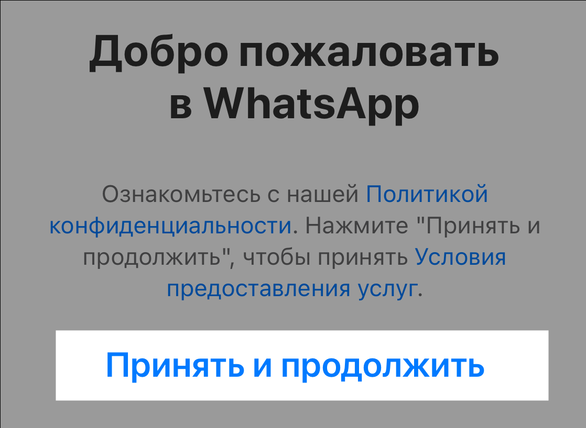
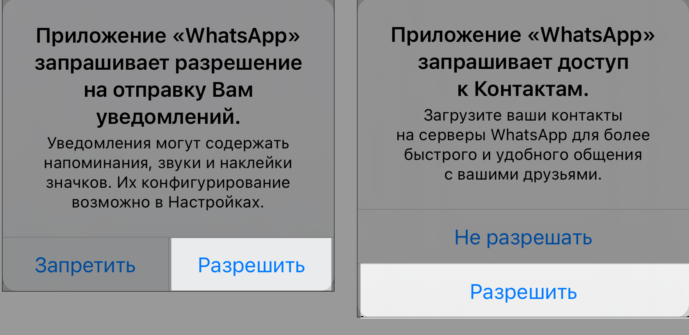
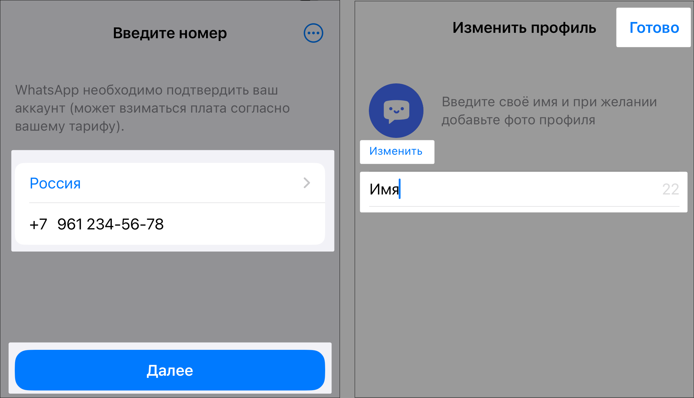
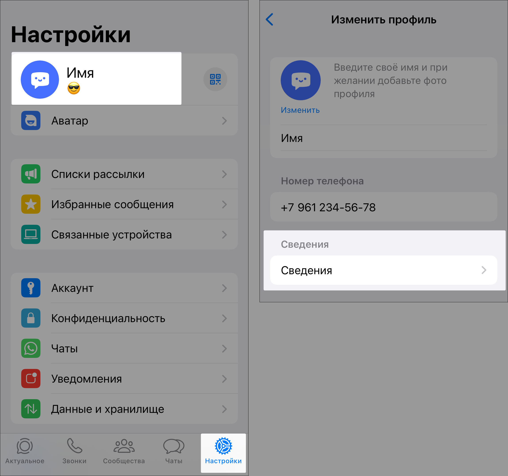
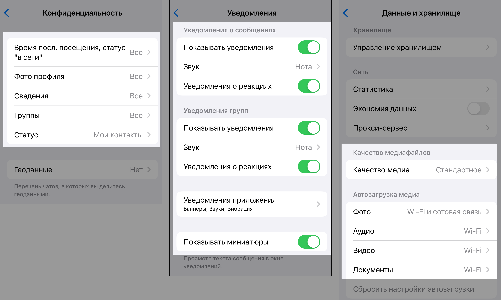
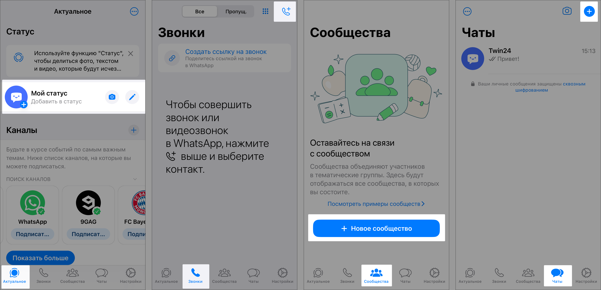

# Начало работы с WhatsApp

WhatsApp — это бесплатное приложение для быстрого, простого и безопасного обмена сообщениями и совершения звонков.

В этой статье вы узнаете, как:

- [Установить WhatsApp и зарегистрироваться](#установка-и-регистрация)
- [Настроить профиль](#настройка-профиля)
- [Настроить приложение](#настройка-приложения)
- [Начать пользоваться WhatsApp](#использование)

## Установка и регистрация

Чтобы начать пользоваться WhatsApp, нужно установить приложение и зарегистрироваться:

1. Скачайте приложение WhatsApp из [AppStore](https://apps.apple.com/rs/app/whatsapp-messenger/id310633997) или [Google Play](https://play.google.com/store/apps/details?id=com.whatsapp&hl=en&pli=1).

1. Откройте приложение и нажмите **Принять и продолжить**, чтобы принять [Политику конфиденциальности](https://www.whatsapp.com/legal/privacy-policy?lang=ru) и [Условия предоставления услуг](https://www.whatsapp.com/legal/terms-of-service?lang=ru):

    

1. Нажмите **Разрешить**, чтобы дать разрешение на отправку уведомлений и доступ к вашим контактам:

    

1. Введите свой номер, выберите страну и нажмите **Далее**. На следующем экране введите свое имя, при желании добавьте фото профиля и нажмите **Готово**:

    

## Настройка профиля

Перед использованием настройте свой профиль так, чтобы другие пользователи понимали, кто вы:

1. Зайдите во вкладку **Настройки** и нажмите на свое имя
2. Откроется экран **Изменить свой профиль**, где вы можете изменить имя, номер телефона, фото профиля, а также написать сведения о себе:

    

## Настройка приложения

По умолчанию WhatsApp:

- Показывает всем пользователям всю информацию о вас, кроме геоданных и статуса
- Присылает все уведомления со звуком, баннерами и вибрацией
- Скачивает медиа в стандартном качестве, не экономит данные и загружает фотографии через мобильную связь

Если вы хотите изменить эти параметры, можете сделать это в соответствующих разделах на вкладке **Настройки**:

Подробнее о настройке других параметров вы можете прочитать в разделе [Изменение настроек приложения](example.com).

## Использование

После установки и настройки вы можете начинать пользоваться WhatsApp:

- Поставить [статус](example.com)
- Подписаться на [канал](example.com)
- Позвонить или принять [звонок](example.com)
- Присоединиться к [сообществу](example.com)
- Создать новый [чат](example.com)

Все эти функции можно найти на соответствующих вкладках нижней панели:

